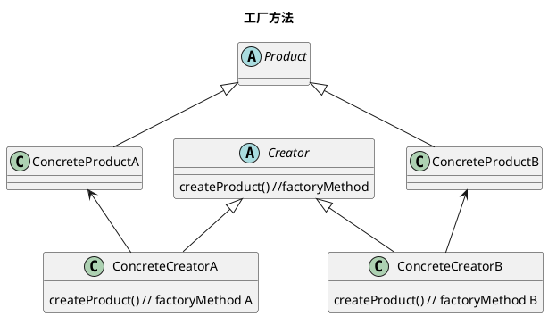
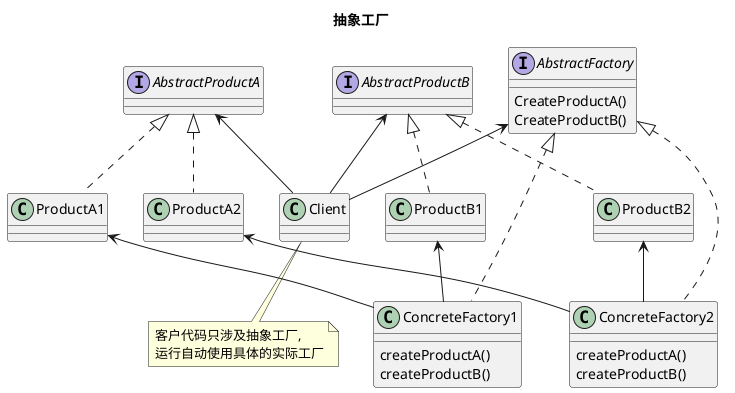

`pizzaStore` 即一个 `creator`.    
`creator` 有`factoryMethod()`和`anOperation()`,它实现所有操作`product`的方法,但不会实现`factoryMethod()`.
`NYStylePizzaStore` 和 `MiamiStylePizzaStore`即`ConcreteCreator`.

- 工厂方法: 生产一种`product`,使用继承,把对象的创建委托给子类,子类实现工厂方法创建对象即可.
- 抽象工厂:提供一个 `interface`,这个接口内每个方法都负责创建一个`product`(使用工厂方法),用于创建相关或依赖对象的产品家族(一系列产品),而不需要明确指定具体类.

- `AbstractFactory`定义了一个 `interface`,包含一组方法来生成多个种类的 `product`
- `ConcreteFactoryA/B`具体工厂实现不同的产品家族.
- `AbstractProductA/B`,产品家族,每个具体工厂都能生成一组产品
- 在进行`createProductA()`时,实际使用的工厂方法.