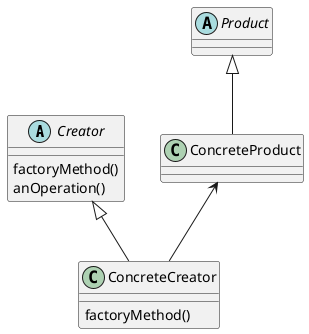

`pizzaStore` 即一个 `creator`.    
`creator` 有`factoryMethod()`和`anOperation()`,它实现所有操作`product`的方法,但不会实现`factoryMethod()`.
`NYStylePizzaStore` 和 `MiamiStylePizzaStore`即`ConcreteCreator`.

```plantuml
@startuml
Abstract class Creator
Creator : factoryMethod()
Creator : anOperation()

Creator <|-- ConcreteCreator
ConcreteCreator : factoryMethod()

Abstract class Product

Product <|-- ConcreteProduct 

ConcreteProduct <-- ConcreteCreator

@enduml
```